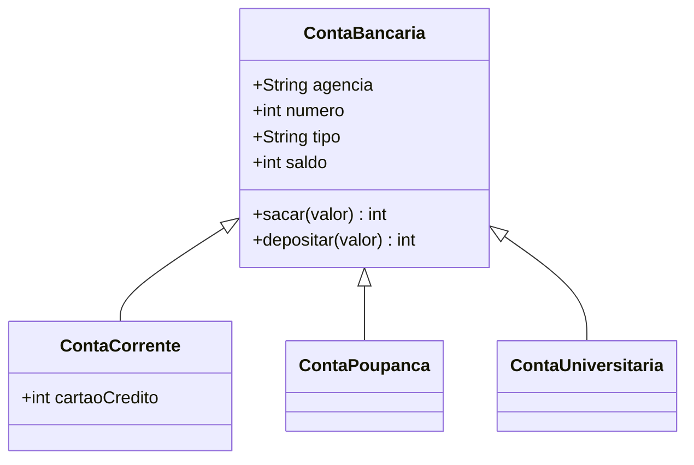

# Uso de classes em Javascript

### Exemplo de Contas bancárias com herança

```mermaid
%% graph TD;
classDiagram
  ContaBancaria <|-- ContaCorrente
  ContaBancaria <|-- ContaPoupanca
  ContaBancaria <|-- ContaUniversitaria
  ContaBancaria : +String agencia
  ContaBancaria : +int numero
  ContaBancaria : +String tipo
  ContaBancaria : +int saldo
  ContaBancaria : +sacar(valor) int
  ContaBancaria : +depositar(valor) int
  class ContaCorrente {
    +int cartaoCredito
  }
  %% ContaBancaria-->ContaCorrente
  %% ContaBancaria-->ContaPoupanca
  %% ContaBancaria-->ContaUniversitaria
```

### Ideias
- [ ] Criar testes com Mocha e Chai
- [ ] Criar um front para a criação e visualização das contas
