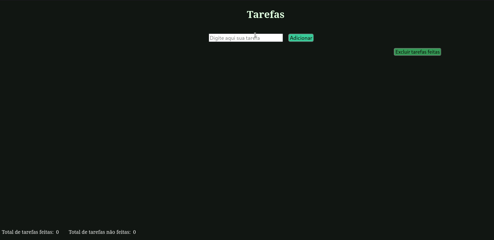

# Desafio proposto pela @stebsnusch 

### Ideias
- [x] Limpar input depois de adicionar tarefa
- [ ] Colocar tarefas numa caixa
- [x] Mudar estilo dos botões
- [x] Adicionar cores
- [ ] Usar localStorage pra manter tarefas na sessão
- [ ] Criar botão de editar tarefa
- [ ] Criar timer pra cada tarefa
- [x] Criar modal para mensagem

